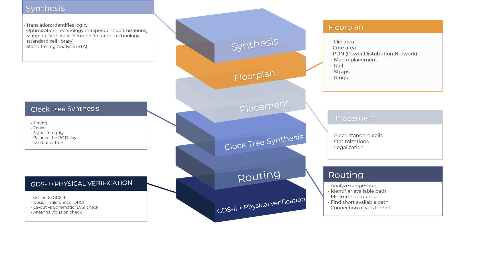

# OpenLANE Workshop
Welcome to OpenLANE Workshop github. Here you have access to some of the designs that are passed through the flow during the scope of this workshop. The files that come along with the designs are: 
1. Register Transfer Level (RTL).
2. Scripts to run on OpenLane.
3. Design Exchange Format (DEF).
4. Library Exchange Format (LEF)
5. Final GDSII layout.

## OpenLANE_with_Google-Sky130-PDK

OpenLANE is an automated RTL2GDS flow that uses multiple open-source tools to perform the auto place and route of an ASIC design. Tools used in the OpenLANE flows are listed below:


**Overall RTL2GDS OpenLane Flow**



## Pre-Requisites
First you need to download script from [here](https://gist.github.com/zeeshanrafique23/11dbef9b83075b06b9ec90fddb8dc96f) and after pulling up the terminal, type

```bash
./openlane_setup.sh
```
and press Enter.

To ensure that all installation is upto date run this command in OpenLANE path
```
make test
```
## Directory Structure
The following directory structure

    ├── images
    ├── picorv32a
    |   ├── src
    |   ├── def
    |   ├── gds
    |   ├── scripts
    ├── reports
    ├── spm
    |   ├── src
    |   ├── def
    |   ├── gds
    |   ├── scripts
    ├──manual_macro_placement_test
    |   ├── src
    |   ├── def
    |   ├── gds
    |   ├── macros
    |   ├── scripts
    ├── BRISC-V_single_cycle
    |   ├── src
    |   ├── def
    |   ├── gds
    |   ├── scripts
    

The README that comes along with the designs are: 
1. picorv32a - a description of an Interactive flow.
2. spm - a description of Non-interactive flow.
3. manual_macro_placement_test - a description of macro placement.
4. BRISC-V_single_cycle is a set of tasks for this workshop.

The manuals for this workshop for each day's session can be found [here](https://github.com/merledu/OpenLane_Workshop/tree/main/docs)